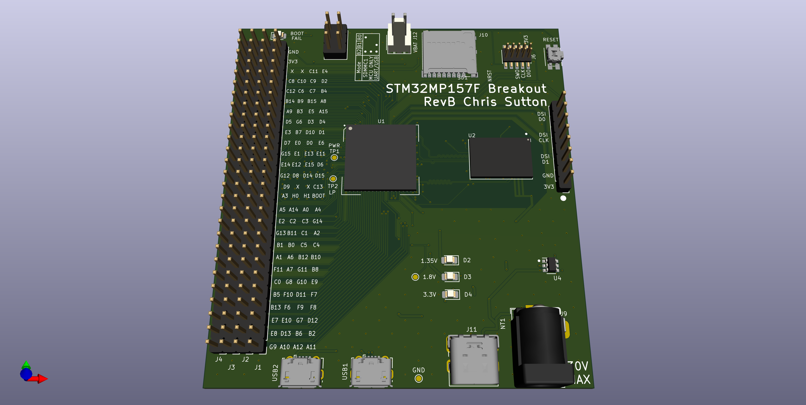
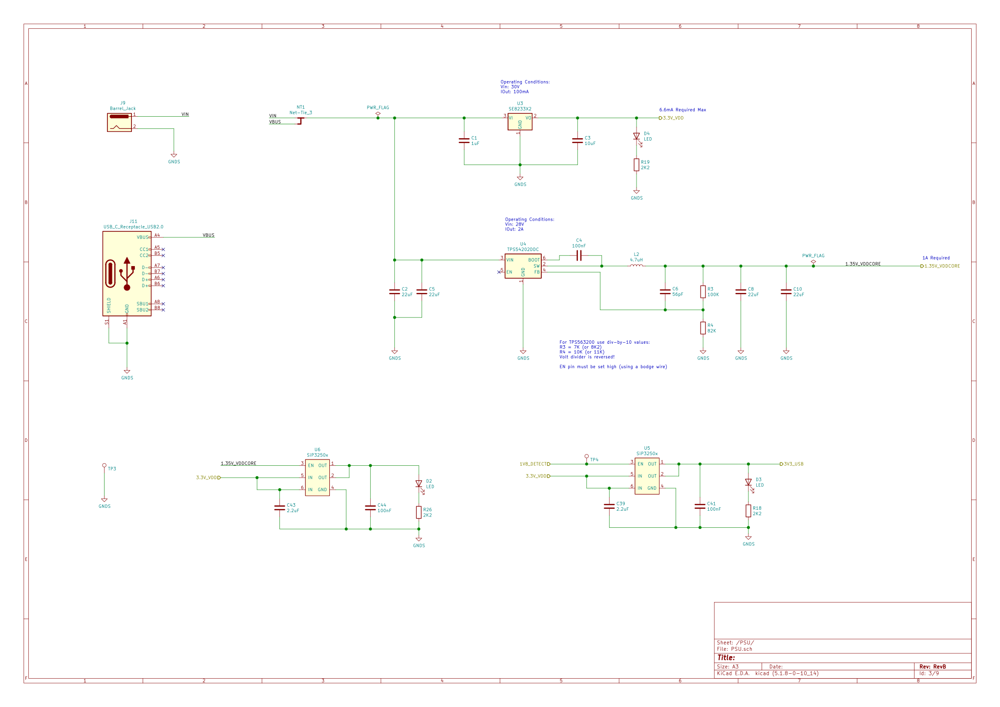
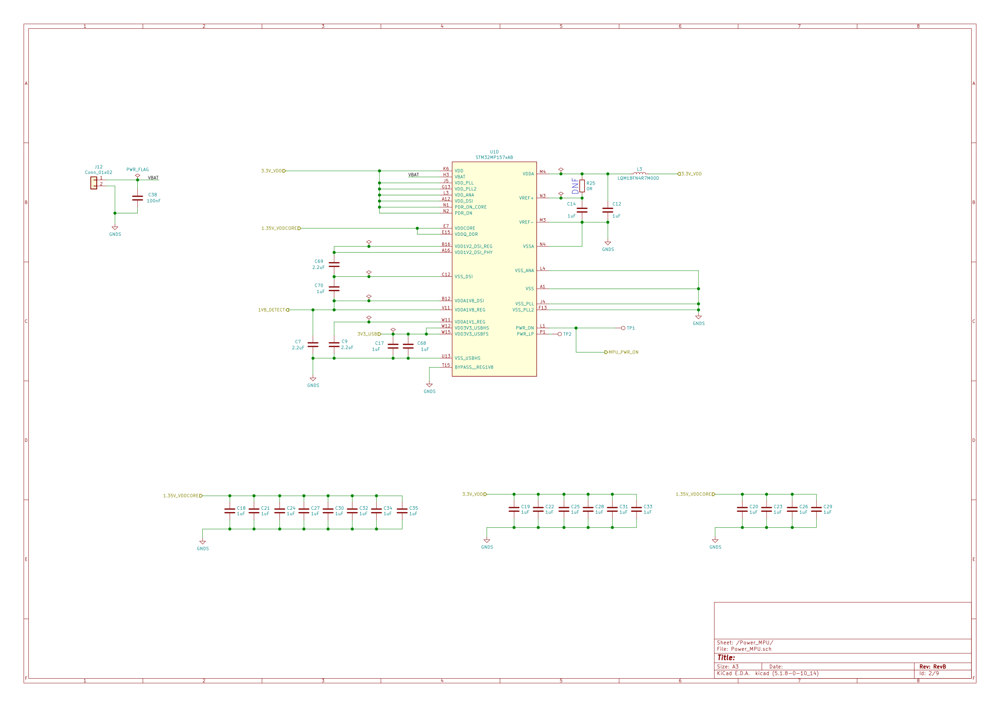

### STM32MP1 Embedded Linux breakout board RevB

A development board for the STM32MP1 Application Microprocessor with *all MPU pins routed through to 2.54mm headers.* No exotic proprietary connectors needed!

The power supply is scheme is fairly complicated. I tried a discrete scheme using a single LDO for the 3.3V rail, a buck regulator for the 1.35V rail and a load switch to detect the 1.8V rail from the MPU and power the VDD3V3_USBFS and VDD3V3_USBHS internal regulator on the MPU. You need to pick a transistor that will fully switch on at only 1.8V. After having some issues I played it safe with the [SIP3250](https://www.mouser.co.uk/datasheet/2/427/sip32508-1763863.pdf) load switch, which turns on as low as 1.2V according to the datasheet


The characteristics seem to back this up until you get to the Fig.10. Still this is more than enough to use with 1.8V.
|||
|:---:|:---:|


In future revisions I may use a single PMIC. 

|Power Supply Rail|MPU Pin Name|MPU Pin #|Comment|
|:---:|:---|:---|:---:|
|3.3v|VDD<br>VBAT<br>VDD_PLL <br>VDD_PLL2<br>VDD_ANA<br>VDD_DSI<br>PDR_ON_CORE<br>PDR_ON|K6<br>H3<br>J5<br>G13<br>L3<br>A12<br>N1<br>N2|Linear regulator ([SE8233X2](https://datasheet.lcsc.com/szlcsc/1912111437_Seaward-Elec-SE8233X2_C437587.pdf))|
|3.3v|VDDA<br>VREF+|M4<br>N3|via inductor L3<br>If JP4 is connected (default)|
|3.3v|VDD3V3_USBFS<br>VDD3V3_USBHS|W12<br>W15|via NMOS ([DMG2302U](https://datasheet.octopart.com/DMG2302U-7-Diodes-Inc.-datasheet-103571615.pdf)) when 1.85v rail is detected from MPU
|1.35v|VDD<br>VDDQ<br>VDDCORE<br>VDDQ_DDR|B2<br>A1<br>E7<br>E15|Buck regulator [TPS54202](http://www.ti.com/lit/ds/symlink/tps54202.pdf)
|1.85v|VDDA1V8_REG|V11|Internal regulator, externally connect to VDDA1V8_DSI (B12)
|1.2v|VDD1V2_DSI_REG|B16|Internal regulator, externally connected to VDD1V2_DSI_PHY (A16)
|1.1v|VDDA1V1_REG|W11|Interal regulator, internally connected.|

*Note*: 3.3v rail is also connected to:
- SWD debug interface
- SDIO connectors (microSD)
- pull-ups for the BOOT pins
- external power output on the pin headers (pin #26 on J1, J2, J3, J4)



[Bill of materials](STM32MP1_TestBoard_RevB/doc/bom/STM32MP1_TestBoard_RevB.csv)

[DataSheets](STM32MP1_TestBoard_RevB/doc/datasheets)

### <U>Schematics:</U>

|Overview|Power Supply|
|:---:|:---:|
||

|STM32MP1 Power|STM32MP1 DDR|
|:---:|:---:|
|||

|STM32MP1 GPIO|STM32MP1 Debug|
|:---:|:---:|
|||

### <U>Testing the bare metal board</U>

Before we boot the board with a Linux image. It is helpful to check the MPU is alive and responding. We can use the SEGGER JLink to connect to the cores via the SWD connector (J6). 

#### Connect to the first A7 core (second core is not active by default):
BOOT pins  must be set to B0 and B2.
```
JLinkExe -device STM32MP15XX_A7_0_DUALFLASH -if SWD -speed 4000 -autoconnect 1
```

```
SEGGER J-Link Commander V6.98a (Compiled Mar  5 2021 17:04:44)
DLL version V6.98a, compiled Mar  5 2021 17:04:29

Connecting to J-Link via USB...O.K.
Firmware: J-Link V11 compiled Feb  4 2021 12:59:17
Hardware version: V11.00
S/N: 261002652
License(s): FlashBP, GDB
OEM: SEGGER-EDU
VTref=3.341V
Device "STM32MP15XX_A7_0_DUALFLASH" selected.


Connecting to target via SWD
ConfigTargetSettings() start
ConfigTargetSettings() end
InitTarget() start
InitTarget() end
Found SW-DP with ID 0x6BA02477
DPIDR: 0x6BA02477
AP map detection skipped. Manually configured AP map found.
AP[0]: AXI-AP (IDR: Not set)
AP[1]: APB-AP (IDR: Not set)
AP[2]: AHB-AP (IDR: Not set)
Using preconfigured AP[1] as APB-AP
AP[1]: APB-AP found
Found Cortex-A7 r0p5
6 code breakpoints, 4 data breakpoints
Debug architecture ARMv7.1
Data endian: little
Main ID register: 0x410FC075
I-Cache L1: 32 KB, 512 Sets, 32 Bytes/Line, 2-Way
D-Cache L1: 32 KB, 128 Sets, 64 Bytes/Line, 4-Way
Unified-Cache L2: 256 KB, 512 Sets, 64 Bytes/Line, 8-Way
System control register:
  Instruction endian: little
  Level-1 instruction cache enabled
  Level-1 data cache enabled
  MMU enabled
  Branch prediction enabled
Memory zones:
  Zone: Default Description: Default access mode
  Zone: APB-AP (AP1) Description: DMA like acc. in AP1 addr. space
  Zone: AHB-AP (AP2) Description: DMA like acc. in AP2 addr. space
Cortex-A7 identified.

```

#### Connect to the M4 core:
BOOT pins  must be set to B2 only.
```
JLinkExe -device STM32MP15XX_M4_DUALFLASH -if SWD -speed 4000 -autoconnect 1
```

```
SEGGER J-Link Commander V6.98a (Compiled Mar  5 2021 17:04:44)
DLL version V6.98a, compiled Mar  5 2021 17:04:29

Connecting to J-Link via USB...O.K.
Firmware: J-Link V11 compiled Feb  4 2021 12:59:17
Hardware version: V11.00
S/N: 261002652
License(s): FlashBP, GDB
OEM: SEGGER-EDU
VTref=3.342V
Device "STM32MP15XX_M4_DUALFLASH" selected.


Connecting to target via SWD
ConfigTargetSettings() start
ConfigTargetSettings() end
InitTarget() start
InitTarget() end
Found SW-DP with ID 0x6BA02477
DPIDR: 0x6BA02477
AP map detection skipped. Manually configured AP map found.
AP[0]: AXI-AP (IDR: Not set)
AP[1]: APB-AP (IDR: Not set)
AP[2]: AHB-AP (IDR: Not set)
AP[2]: Core found
AP[2]: AHB-AP ROM base: 0xE00FF000
CPUID register: 0x410FC241. Implementer code: 0x41 (ARM)
Found Cortex-M4 r0p1, Little endian.
FPUnit: 6 code (BP) slots and 2 literal slots
Detection of Coresight components via ROM table search disabled by user
Cortex-M4 identified.

```


Here is a photo successfully connecting to the A7 core on the assembled board using JLink (via SWD). It lives!


